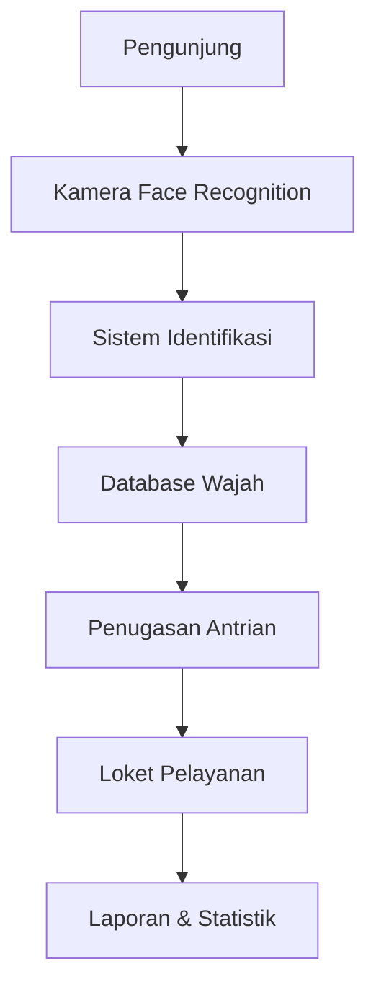
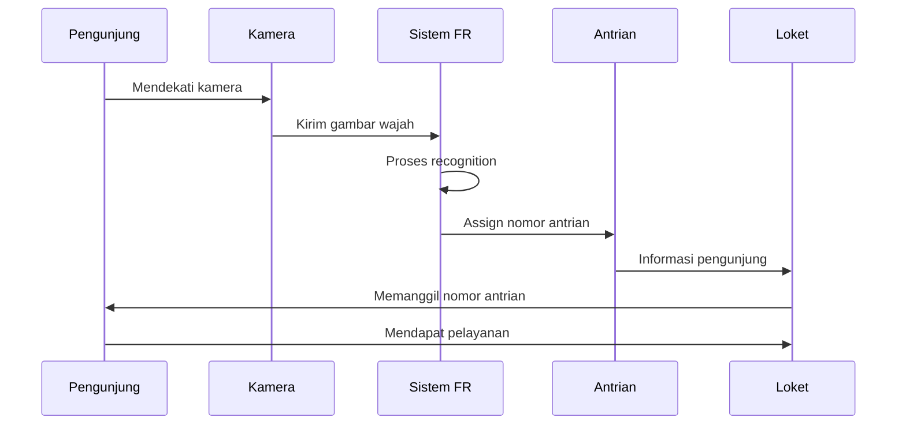

# Sistem Antrian Berbasis Face Recognition Pendaftaran Siswa

## 📋 Deskripsi Proyek

Sistem antrian cerdas yang menggunakan teknologi **face recognition** untuk mengidentifikasi pengunjung secara otomatis. Sistem ini dilengkapi dengan simulasi jumlah loket, tiket, pengunjung, dan waktu pelayanan.

## 🎯 Fitur Utama

- **Facial Recognition** untuk identifikasi pengunjung
- **Manajemen Antrian** otomatis
- **Simulasi Real-time** kinerja sistem
- **Dashboard Monitoring** untuk admin
- **Laporan Statistik** performa antrian

## 🏗️ Arsitektur Sistem



## 📊 Komponen Simulasi

### 1. **Konfigurasi Loket**
```
┌─────────────┬─────────────┬─────────────┐
│   LOKET 1   │   LOKET 2   │   LOKET 3   │
│  Status:    │  Status:    │  Status:    │
│  [AKTIF]    │  [ISTIRAHAT]│  [AKTIF]    │
└─────────────┴─────────────┴─────────────┘
```

### 2. **Parameter Simulasi**

| Parameter | Nilai Default | Range |
|-----------|---------------|--------|
| Jumlah Loket | 3 | 1-10 |
| Pengunjung/Jam | 50 | 10-200 |
| Waktu Pelayanan | 5 menit | 1-15 menit |
| Akurasi Face Recognition | 95% | 85-99% |

## 🖥️ Interface Sistem


### Antrian App

[antrian app](https://sismadi.github.io/simulasi-pemodelan/)


### Dashboard Admin


**Fitur Dashboard:**
- Real-time monitoring antrian
- Grafik jumlah pengunjung
- Status loket pelayanan
- Notifikasi sistem

### Antrian Pengunjung


## ⚙️ Teknologi yang Digunakan

```python
# Contoh kode face recognition
 <!-- OpenCV.js -->
  <script async src="https://docs.opencv.org/4.x/opencv.js" onload="onOpenCvReady()"></script>
 ```

## 📈 Simulasi Performa

### Grafik Waktu Tunggu


### Statistik Harian
| Metric | Nilai |
|--------|-------|
| Total Pengunjung | 150 |
| Rata-rata Waktu Tunggu | 8.5 menit |
| Kepuasan Pelanggan | 92% |
| Akurasi Recognition | 96.2% |

## 🔧 Konfigurasi Hardware

### Spesifikasi Minimum
- **Processor**: Intel i5 atau setara
- **RAM**: 8GB DDR4
- **Storage**: 256GB SSD
- **Kamera**: 1080p Webcam
- **OS**: Windows 10/11 atau Linux Ubuntu

### Spesifikasi Recommended
- **Processor**: Intel i7 atau Ryzen 7
- **RAM**: 16GB DDR4
- **Storage**: 512GB NVMe SSD
- **Kamera**: 4K Webcam atau IP Camera
- **GPU**: NVIDIA GTX 1660 (untuk processing lebih cepat)

## 🚀 Instalasi dan Setup

### 1. **Prasyarat Sistem**
```bash
# Install dependencies
pip install opencv-python
pip install face-recognition
pip install numpy
pip install pandas
```

### 2. **Konfigurasi Instalasi Database**
```python
# config.py

SYSTEM_CONFIG = {
    'max_queues': 5,
    'recognition_threshold': 0.6,
    'max_wait_time': 30,  # menit
    'auto_assign': True
}
```

## 📋 Flow Proses

1. **Pendaftaran Wajah** → Pengunjung melakukan registrasi wajah
2. **Identifikasi** → Sistem mengenali wajah yang terdaftar
3. **Penugasan Antrian** → Otomatis menugaskan ke loket tersedia
4. **Pelayanan** → Proses di loket
5. **Update Status** → Sistem memperbarui status antrian

## 🎮 Simulasi Kontrol

### Panel Kontrol Admin


**Kontrol yang Tersedia:**
- ✅ Tambah/Pindah Loket
- ✅ Atur Kecepatan Simulasi
- ✅ Generate Laporan
- ✅ Reset Sistem

## 📊 Metrik Kinerja

### Key Performance Indicators (KPI)
1. **Waktu Tunggu Rata-rata**
2. **Akurasi Pengenalan Wajah**
3. **Utilisasi Loket**
4. **Throughput Sistem**

## 🔄 Workflow Sistem



## 💾 Database Schema

### Tabel Pengunjung
```sql
CREATE TABLE visitors (
    id INT PRIMARY KEY AUTO_INCREMENT,
    face_encoding BLOB,
    name VARCHAR(100),
    registration_date DATETIME,
    last_visit DATETIME,
    total_visits INT DEFAULT 0
);
```

### Tabel Antrian
```sql
CREATE TABLE queue (
    queue_id INT PRIMARY KEY AUTO_INCREMENT,
    visitor_id INT,
    assigned_counter INT,
    queue_number VARCHAR(10),
    status ENUM('waiting', 'serving', 'completed'),
    created_at DATETIME,
    served_at DATETIME
);
```

## 🛠️ Troubleshooting

### Common Issues & Solutions

| Masalah | Penyebab | Solusi |
|---------|----------|---------|
| Low recognition accuracy | Pencahayaan buruk | Perbaiki lighting |
| Slow processing | Hardware lemah | Upgrade RAM/GPU |
| System crash | Memory leak | Restart service |

## 📞 Support

Untuk bantuan teknis dan support:
- **Email**: support@queuesystem.com
- **Hotline**: 1500-123
- **Documentation**: docs.queuesystem.com

---

**Sistem Antrian Face Recognition** © 2024 - All Rights Reserved
